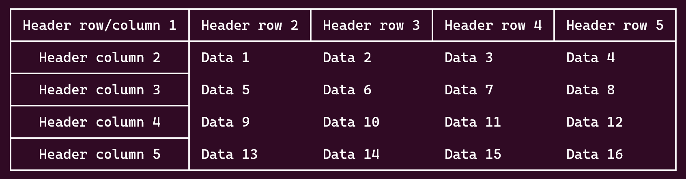
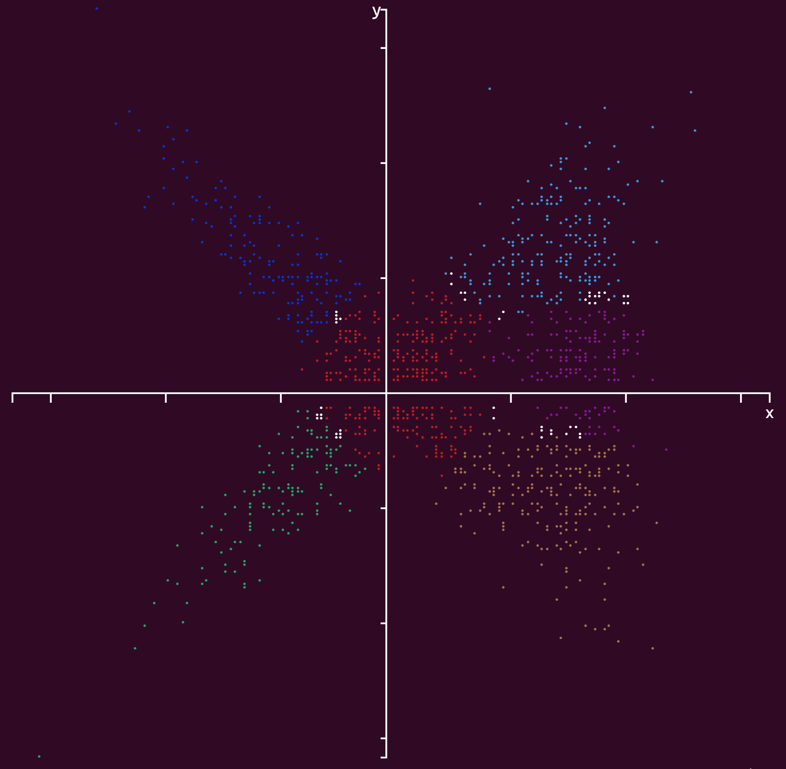

[](https://github.com/tdulcet/Tables-and-Graphs-CLI/actions/workflows/ci.yml)

# Tables and Graphs CLI

Command-line tools to output Tables and Graphs/Plots to the console

Copyright © 2023 Teal Dulcet

These command-line tools use my C++ [Table and Graph libraries](https://github.com/tdulcet/Table-and-Graph-Libs), which use [box-drawing](https://en.wikipedia.org/wiki/Box-drawing_character#Unicode), [Braille](https://en.wikipedia.org/wiki/Braille_Patterns), [fraction](https://en.wikipedia.org/wiki/Number_Forms) and other Unicode characters and [terminal colors and formatting](https://misc.flogisoft.com/bash/tip_colors_and_formatting) to output tables and graphs/plots to the console. The table tool is designed to extend the existing `-t/--table` options of column command from [util-linux](https://en.wikipedia.org/wiki/Util-linux) with much more functionality.

❤️ Please visit [tealdulcet.com](https://www.tealdulcet.com/) to support these programs and my other software development.

## Tables

### Usage

Requires support for C++17 and downloading the Table header only ([`tables.hpp`](https://github.com/tdulcet/Table-and-Graph-Libs/blob/master/tables.hpp)) library into the same directory as the program.

Compile with:
* GCC: `g++ -std=c++17 -Wall -g -O3 -flto table.cpp -o table`
* Clang: `clang++ -std=c++17 -Wall -g -O3 -flto table.cpp -o table`

Run with: `./table [OPTION(S)]... [FILE(S)]...`\
Table cells can contain [Unicode characters](https://en.wikipedia.org/wiki/List_of_Unicode_characters) and formatted text with [ANSI escape sequences](https://en.wikipedia.org/wiki/ANSI_escape_code). See [Help](#help) below for full usage information. See the documentation for the [library options](https://github.com/tdulcet/Table-and-Graph-Libs#options) for more details.

If you want this program to be available for all users, install it. Run: `sudo mv table /usr/local/bin/table` and `sudo chmod +x /usr/local/bin/table`.



### Help

```
$ table --help
Usage:  table [OPTION(S)]... [FILE(S)]...
or:     table <OPTION>
Convert input into a table. With no FILE, or when FILE is -, read from standard input. Empty lines are ignored. All rows should have the same number of columns. Table cells can contain Unicode characters and formatted text with ANSI escape sequences. See examples below.

Options:
    Mandatory arguments to long options are mandatory for short options too.
    -t, --title <TITLE>     Table Name/Title
    -n, --name <TITLE>          Show a title above the table. The title is word wrapped based on the current width of the terminal.
    -N, --columns <NAMES>   Column names
                                Adds row to top of the table. Provide either a comma separated list of names or specify this option multiple times, once for each column.
    -M, --rows <NAMES>      Row names
                                Adds column to left of the table. Provide either a comma separated list of names or specify this option multiple times, once for each row.
    -l, --left              Left align (default)
    -R, --right             Right align
    -r, --header-row        Header row
                                Header rows are bolded, centered and have a border.
    -c, --header-column     Header column
                                Header columns are bolded, centered and have a border.
    -b, --no-border         No table border
    -C, --cell-border       Show cell border
    -L, --keep-empty-lines  Do not ignore empty lines
    -s, --separator <SEP>   Characters to delimit columns/fields (default any whitespace)
    -d, --delimiter <SEP>
    -z, --zero-terminated   Line delimiter is NUL, not newline
    -p, --padding <PADDING> Cell padding (default 1)
    -S, --style <STYLE>     Border style (default 'light')
                                <STYLE> can be:
                                    ascii:          ASCII
                                    basic:          Basic
                                    light:          Light (default)
                                    heavy:          Heavy
                                    double:         Double
                                    arc:            Light Arc
                                    light-dashed:   Light Dashed
                                    heavy-dashed:   Heavy Dashed

        --help              Display this help and exit
        --version           Output version information and exit

Examples:
    Output table
    $ printf 'a b c\n1 2 3\n' | table

    Output table with separator/delimiter
    $ printf 'a:b:c\n1::3\n' | table --separator ':'

    Output table with header row
    $ ls -l --color | tail -n +2 | table --header-row --columns 'PERM,LINKS,OWNER,GROUP,SIZE,MONTH,DAY,HH:MM/YEAR,NAME'

    Output table with header row and column (Bash syntax)
    $ printf '%s\t%s\t%s\t%s\n' 'Data '{1..16} | table --separator $'\t' --header-row --header-column --columns 'Header row/column 1' --columns='Header row '{2..5} --rows='Header column '{2..5}

    Output table of values (Bash syntax)
    $ for i in {-10..10}; do echo "$i $(( i + 1 ))"; done | table --header-row --columns 'x,y'

    Output sorted table (Bash syntax)
    $ for i in {0..4}; do for j in {0..4}; do echo -n "$(( RANDOM * RANDOM )) "; done; echo; done | sort -n -k 1 | table

    Output a table in each style (Bash syntax)
    $ for s in ascii basic light heavy double arc light-dashed heavy-dashed; do printf 'a b c\n1 2 3\n' | table --cell-border --style=$s --title "Style: $s"; done

```

## Graphs/Plots

### Usage

Requires support for C++17 and downloading both the Table ([`tables.hpp`](https://github.com/tdulcet/Table-and-Graph-Libs/blob/master/tables.hpp)) and Graph ([`graphs.hpp`](https://github.com/tdulcet/Table-and-Graph-Libs/blob/master/graphs.hpp)) header only libraries into the same directory as the program. The Table library is used to output the legends.

Compile with:
* GCC: `g++ -std=c++17 -Wall -g -O3 -flto graph.cpp -o graph`
* Clang: `clang++ -std=c++17 -Wall -g -O3 -flto graph.cpp -o graph`

Run with: `./graph [OPTION(S)]... [FILE(S)]...`\
With a single input and column it will output a histogram, otherwise it will output a plot. See [Help](#help-1) below for full usage information. See the documentation for the [library options](https://github.com/tdulcet/Table-and-Graph-Libs#options-1) for more details.

If you want this program to be available for all users, install it. Run: `sudo mv graph /usr/local/bin/graph` and `sudo chmod +x /usr/local/bin/graph`.



### Help

```
$ graph --help
Usage:  graph [OPTION(S)]... [FILE(S)]...
or:     graph <OPTION>
Convert input into a graph/plot. With no FILE, or when FILE is -, read from standard input. Empty lines are ignored. With a single input, each row can have one or more columns in the form 'x y1 ... yn', which will be converted to 'x y1' ... 'x yn'. With a single input and column it will output a histogram, otherwise it will output a plot. With multiple inputs, rows should have exactly two columns in the form 'x y'. See examples below.

Options:
    Mandatory arguments to long options are mandatory for short options too.
    -t, --title <TITLE>     Graph Name/Title
        --name <TITLE>          Show a title above the graph. The title is word wrapped based on the current width of the terminal.
    -h, --height <HEIGHT>   Graph height (default 0)
                                If HEIGHT is 0, it will be set to the current height of the terminal (number of rows times four).
    -w, --width <WIDTH>     Graph width (default 0)
                                If WIDTH is 0, it will be set to the current width of the terminal (number of columns times two).
    -x, --x-min <XMIN>      Minimum x value (default 0)
                                If XMIN and XMAX are both 0, they will be set to the respective minimum and maximum values of x in the input.
    -X, --x-max <XMAX>      Maximum x value (default 0)
                                If XMIN and XMAX are both 0, they will be set to the respective minimum and maximum values of x in the input.
    -y, --y-min <YMIN>      Minimum y value (default 0)
                                If YMIN and YMAX are both 0, they will be set to the respective minimum and maximum values of y in the input.
    -Y, --y-max <YMAX>      Maximum y value (default 0)
                                If YMIN and YMAX are both 0, they will be set to the respective minimum and maximum values of y in the input.
    -C, --type <TYPE>       Type (default 'braille')
                                <TYPE> can be:
                                    braille:        Braille (default)
                                    block:          Block
    -m, --mark <MARK>       Mark type (default 'dot')
                                <MARK> can be:
                                    dot:            Dot (default)
                                    plus:           Plus
                                    square:         Square
    -b, --border            Border
                                Show graph and legend border.
    -a, --no-axis           No axis
                                Do not show the axis. Implies --no-axis-labels, --no-ticks and --no-units-labels.
    -l, --no-axis-labels    No axis labels
    -T, --no-ticks          No axis tick marks
                                Implies --no-units-labels.
    -u, --no-units-labels   No axis units labels
        --x-units <UNIT>    X-axis units format (default 'fracts')
                                See UNIT below.
        --y-units <UNIT>    Y-axis units format (default 'fracts')
                                See UNIT below.
    -n, --names <NAMES>     Series names
                                Provide either a comma separated list of names or specify this option multiple times, once for each input/series.
    -L, --legend            Legend
                                Show a legend below the graph. Uses the --names values or the first line/row of each input if that options is not provided.
    -s, --separator <SEP>   Characters to delimit columns/fields (default any whitespace)
    -d, --delimiter <SEP>
    -z, --zero-terminated   Line delimiter is NUL, not newline
    -i, --int               Integer numbers
                                Read input values as integer numbers.
    -f, --float             Floating point numbers (default)
                                Read input values as floating point numbers.
    -S, --style <STYLE>     Border style (default 'light')
                                <STYLE> can be:
                                    ascii:          ASCII
                                    basic:          Basic
                                    light:          Light (default)
                                    heavy:          Heavy
                                    double:         Double
                                    arc:            Light Arc
                                    light-dashed:   Light Dashed
                                    heavy-dashed:   Heavy Dashed
    -c, --color <COLOR>     Graph/Plot color (default 'red')
                                Used only when plotting a single input/series. Otherwise, colors red - white (2 - 16) are used inorder. The system default color is used where the plots cross. <COLOR> can be:
                                    default:        System default
                                    black:          Black
                                    red:            Red (default)
                                    green:          Green
                                    yellow:         Yellow
                                    blue:           Blue
                                    magenta:        Magenta
                                    cyan:           Cyan
                                    light-gray:     Light Gray
                                    dark-gray:      Dark Gray
                                    light-red:      Light Red
                                    light-green:    Light Green
                                    light-yellow:   Light Yellow
                                    light-blue:     Light Blue
                                    light-magenta:  Light Magenta
                                    light-cyan:     Light Cyan
                                    white:          White

        --help              Display this help and exit
        --version           Output version information and exit

UNIT options:
    number:         Locale number format (similar to 'numfmt --grouping')
                        e.g. 1234.25 → 1,234.25
    si:             Auto-scale to the SI standard (similar to 'numfmt --to=si')
                        e.g. 1000 → 1K
    iec:            Auto-scale to the IEC standard (similar to 'numfmt --to=iec')
                        e.g. 1024 → 1K
    iec-i:          Auto-scale to the IEC standard (similar to 'numfmt --to=iec-i')
                        e.g. 1024 → 1Ki
    fracts:         Locale number format, but convert fractions and mathematical constants to Unicode characters (default)
                        e.g. 1234.25 → 1,234¼
    percent:        Percentage format
                        e.g. 0.123 → 12.3%
    date:           Locale date format (same as 'date +%x')
                        e.g. 2147483647 → 01/19/2038
    time:           Locale time format (same as 'date +%X')
                        e.g. 2147483647 → 03:14:07 AM
    monetary:       Locale monetary/currency format (does not work with the ‘C’ locale)
                        e.g. 123 → $1.23

Examples:
    Output plot
    $ printf '1 1\n2 2\n3 3\n4 4\n5 5\n6 6\n' | graph --height 80 --width 80 --x-min -10 --x-max 10 --y-min -10 --y-max 10

    Output plot of single series (Bash Syntax)
    $ for i in {-20..20}; do echo "$i $(( i + 1 ))"; done | graph --height 160 --width 160 --x-min -20 --x-max 20 --y-min -20 --y-max 20

    Output plot of multiple series (Bash Syntax)
    $ for i in {-20..20}; do echo "$i $(( 2 * i )) $(( i ** 2 ))"; done | graph --height 160 --width 160 --x-min -20 --x-max 20 --y-min -20 --y-max 20

    Output graph of multiple functions
    $ awk 'BEGIN { pi=atan2(0, -1); width=160; xmin=-(2*pi); xmax=2*pi; xstep=(xmax-xmin)/width; for(i=0; i<width*2; ++i) { x=((i/2)*xstep)+xmin; print x,sin(x),cos(x),sin(x)/cos(x) } }' | graph --height 160 --width 160 --y-min -4 --y-max 4 --no-units-labels

    Output a plot in each style (Bash syntax)
    $ for s in ascii basic light heavy double arc light-dashed heavy-dashed; do for i in {0..9}; do echo "$i $(( i + 1 ))"; done | graph --height 80 --width 80 --x-min -10 --x-max 10 --y-min -10 --y-max 10 --style=$s --title "Style: $s"; done

```

## Contributing

Pull requests welcome! Ideas for contributions:

* [Add more options](https://github.com/tdulcet/Table-and-Graph-Libs#contributing)
* Add more examples
* Improve the performance
* Add tests
* Port to other languages (C, Rust, etc.)
